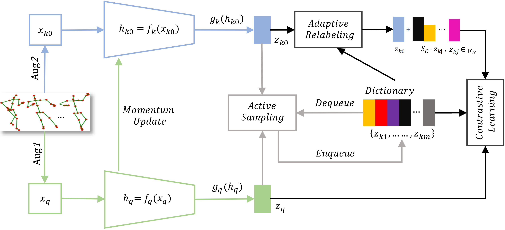
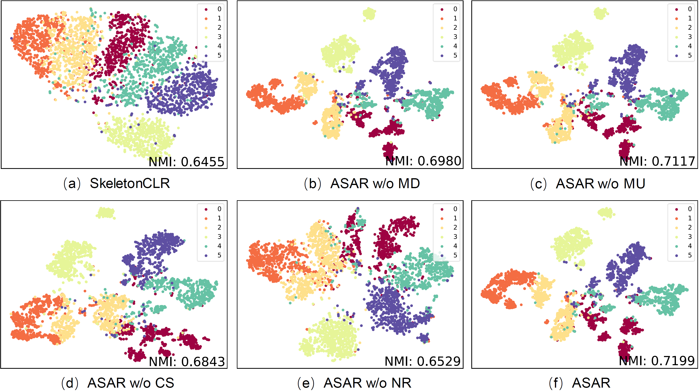

# ASAR  
  
This is an official PyTorch implementation of **"Self-supervised 3D Skeleton Representation Learning with Active Sampling and Adaptive Relabeling" in ICIP2023**.   
  
  
  
## Requirements  
        
  
## Data Preparation  
- Download the raw data of [NTU RGB+D](https://github.com/shahroudy/NTURGB-D) and [PKU-MMD](https://www.icst.pku.edu.cn/struct/Projects/PKUMMD.html).  
- For NTU RGB+D dataset, preprocess data with `tools/ntu_gendata.py`. For PKU-MMD dataset, preprocess data with `tools/pku_part1_gendata.py`.  
- Then downsample the data to 50 frames with `feeder/preprocess_ntu.py` and `feeder/preprocess_pku.py`.  
- If you don't want to process the original data, download the file folder in  [AimCLR](https://github.com/Levigty/AimCLR).  
  
## Installation  
 ```bash# Install torchlight  
$ cd torchlight  
$ python setup.py install  
$ cd ..  
 ```  
## Self-supervised Pre-Training  
  
Example for self-supervised pre-training of **ASAR**. You can change some settings of `.yaml` files in `config/xxx/pretext` folder.  
```bash  
# train on NTU RGB+D 60 xview  
$ python main.py pretrain_asar --config config/ntu60/pretext/pretext_asar_xview.yaml  
  
# train on NTU RGB+D 120 xsub
$ python main.py pretrain_asar --config config/ntu120/pretext/pretext_asar_xsub.yaml  
  
# train on PKU-MMD part1 
$ python main.py pretrain_asar --config config/pkummd/pretext/pretext_asar_pkup1cs.yaml  
```  
  
## Linear Evaluation  
  
Example for linear evaluation of **ASAR**. You can change `.yaml` files in `config/xxx/linear_eval` folder.  
```bash  
# Linear_eval on NTU RGB+D 60 xview  
$ python main.py linear_evaluation --config config/ntu60/linear_eval/linear_eval_asar_xview.yaml  
 
# Linear_eval on NTU RGB+D 120 xsub  
$ python main.py linear_evaluation --config config/ntu120/linear_eval/linear_eval_asar_xsub.yaml  

# Linear_eval on PKU-MMD part1  
$ python main.py linear_evaluation --config config/pkummd/linear_eval/linear_eval_asar_pkup1cs.yaml
```  
  
## Trained models  
  
We release several trained models in [released_model](https://disk.pku.edu.cn:443/link/F5E5C89D0BCF48BF29521267166D379D).  You can download them and test them with linear evaluation by changing `weights` in `.yaml` files.  
  
  
## Visualization  
  
The [**t-SNE**](https://www.jmlr.org/papers/volume9/vandermaaten08a/vandermaaten08a.pdf) visualization of the embeddings after ASAR pre-training on NTU60-xview.  
  
  
  
  
  
## Acknowledgement  
The framework of our code is extended from the following repositories. We sincerely thank the authors for releasing the codes.  
- The framework of our code is based on [SkeletonCLR](https://github.com/LinguoLi/CrosSCLR).  
- The encoder is based on [ST-GCN](https://github.com/yysijie/st-gcn/blob/master/OLD_README.md).  
  
